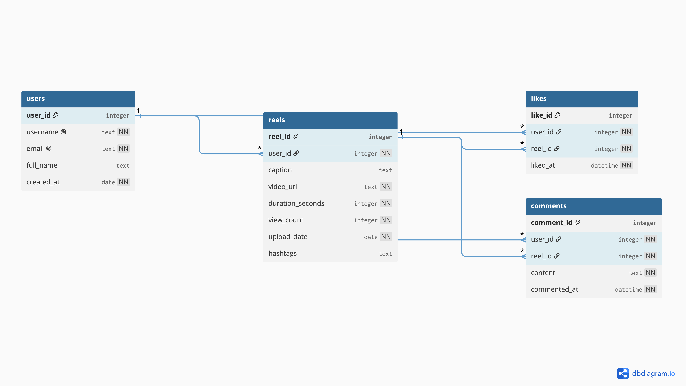
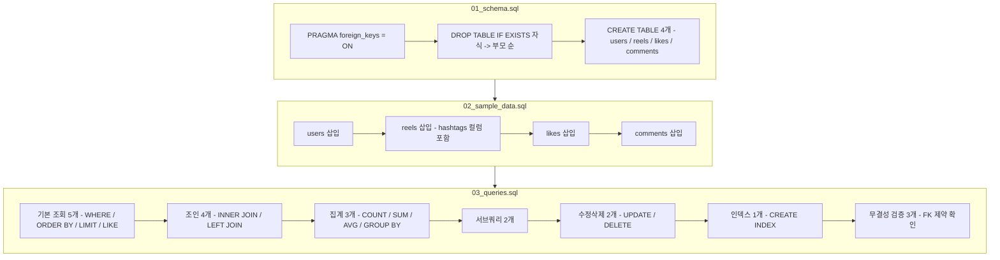

# 프로젝트 소개

인스타그램 릴스와 유사한 SNS 서비스를 가정하여, 데이터베이스 스키마를 설계하고
샘플 데이터를 채운 뒤 실무에서 자주 쓰이는 SQL 패턴(조회, 조인, 집계, 서브쿼리,
수정/삭제, 인덱스)을 구현한 프로젝트입니다. 실행 환경은 SQLite를 기준으로 합니다.

SQL이 처음인 분도 따라가기 쉽도록, 테이블을 최소한으로(4개) 구성했습니다.

## 파일 구조

```
project-root/
├── 01_schema.sql          # 테이블 생성 (DDL)
├── 02_sample_data.sql     # 샘플 데이터 삽입 (DML)
├── 03_queries.sql         # 핵심 SQL 쿼리 17개 + 무결성 검증 3개
├── query_results.md       # 전체 쿼리 실행 결과 캡처
├── SQL Diagram.png        # ERD 다이어그램
├── Relationship.png       # 테이블 관계도
└── README.md              # 프로젝트 설명 문서
```

## 파일 구성

| 파일 | 설명 |
|---|---|
| `01_schema.sql` | 테이블 생성 (DDL). 4개 테이블과 FK 제약조건 정의 |
| `02_sample_data.sql` | 샘플 데이터 삽입 (users 12행, reels 15행, likes 25행, comments 16행) |
| `03_queries.sql` | 핵심 SQL 쿼리 17개 + 무결성 검증 3개 (기본 조회, 조인, 집계, 서브쿼리, 수정/삭제, 인덱스, FK 검증) |
| `query_results.md` | 모든 쿼리의 실제 실행 결과 캡처 (텍스트) |
| `SQL Diagram.png` | 전체 테이블 관계를 나타낸 ERD |
| `Relationship.png` | 테이블 관계도 |

## ERD (Entity-Relationship Diagram)
<p align="center">
  
  
</p>

## 테이블 구조

### users (사용자)
| 컬럼 | 타입 | 제약조건 | 설명 |
|---|---|---|---|
| `user_id` | INTEGER | PK, AUTOINCREMENT | 사용자 고유 ID |
| `username` | TEXT | NOT NULL, UNIQUE | 로그인/표시용 아이디, 중복 불가 |
| `email` | TEXT | NOT NULL, UNIQUE | 이메일, 중복 불가 |
| `full_name` | TEXT | - | 실명 |
| `created_at` | DATE | NOT NULL, DEFAULT `date('now')` | 가입일, 값 생략 시 오늘 날짜 자동 입력 |

### reels (릴스)
| 컬럼 | 타입 | 제약조건 | 설명 |
|---|---|---|---|
| `reel_id` | INTEGER | PK, AUTOINCREMENT | 릴스 고유 ID |
| `user_id` | INTEGER | NOT NULL, FK -> `users.user_id` | 업로더 |
| `caption` | TEXT | - | 게시물 캡션 |
| `video_url` | TEXT | NOT NULL | 영상 URL |
| `duration_seconds` | INTEGER | NOT NULL | 영상 길이(초) |
| `view_count` | INTEGER | NOT NULL, DEFAULT `0` | 조회수 |
| `upload_date` | DATE | NOT NULL | 업로드일 |
| `hashtags` | TEXT | - | 쉼표로 구분된 해시태그 (예: `travel,daily`) |

### likes (좋아요)
| 컬럼 | 타입 | 제약조건 | 설명 |
|---|---|---|---|
| `like_id` | INTEGER | PK, AUTOINCREMENT | 좋아요 고유 ID |
| `user_id` | INTEGER | NOT NULL, FK -> `users.user_id` | 좋아요를 누른 사용자 |
| `reel_id` | INTEGER | NOT NULL, FK -> `reels.reel_id` | 좋아요 대상 릴스 |
| `liked_at` | DATETIME | NOT NULL, DEFAULT `datetime('now')` | 좋아요 누른 시각 |
| (복합) | - | UNIQUE(`user_id`, `reel_id`) | 동일 사용자가 같은 릴스에 중복 좋아요 방지 |

### comments (댓글)
| 컬럼 | 타입 | 제약조건 | 설명 |
|---|---|---|---|
| `comment_id` | INTEGER | PK, AUTOINCREMENT | 댓글 고유 ID |
| `user_id` | INTEGER | NOT NULL, FK -> `users.user_id` | 댓글 작성자 |
| `reel_id` | INTEGER | NOT NULL, FK -> `reels.reel_id` | 댓글이 달린 릴스 |
| `content` | TEXT | NOT NULL | 댓글 내용 |
| `commented_at` | DATETIME | NOT NULL, DEFAULT `datetime('now')` | 댓글 작성 시각 |

## 테이블 관계

4개 테이블은 아래 5개의 1:N 관계로 연결되어 있습니다 (모두 "부모 1 : 자식 N" 구조).

| 부모 | 자식 | 연결 컬럼 | 의미 |
|---|---|---|---|
| `users` | `reels` | `reels.user_id` | 사용자 1명이 릴스를 여러 개 올릴 수 있음 |
| `users` | `likes` | `likes.user_id` | 사용자 1명이 좋아요를 여러 개 누를 수 있음 |
| `users` | `comments` | `comments.user_id` | 사용자 1명이 댓글을 여러 개 남길 수 있음 |
| `reels` | `likes` | `likes.reel_id` | 릴스 1개에 좋아요가 여러 개 달릴 수 있음 |
| `reels` | `comments` | `comments.reel_id` | 릴스 1개에 댓글이 여러 개 달릴 수 있음 |

`likes`와 `comments`는 각각 `users`, `reels` 양쪽을 동시에 참조하기 때문에, 결과적으로
"어떤 사용자가 어떤 릴스에 반응했는지"를 표현하는 다리 역할을 합니다.

## 적용한 제약조건

| 제약조건 | 적용 위치 | 목적 |
|---|---|---|
| `PRIMARY KEY` (`AUTOINCREMENT`) | 4개 테이블의 `*_id` 컬럼 전부 | 각 행을 고유하게 식별, ID 자동 증가 |
| `FOREIGN KEY` | `reels.user_id`, `likes.user_id`/`reel_id`, `comments.user_id`/`reel_id` (5곳) | 참조 무결성 보장. 존재하지 않는 부모 값 삽입을 차단 |
| `UNIQUE` | `users.username`, `users.email` | 동일 아이디/이메일로 중복 가입 방지 |
| `UNIQUE` (복합) | `likes(user_id, reel_id)` | 같은 사용자가 같은 릴스에 좋아요를 두 번 못 누르게 방지 |
| `NOT NULL` | `username`, `email`, `video_url`, `duration_seconds`, `upload_date`, `content` 등 | 비어있으면 안 되는 필수 값 강제 |
| `DEFAULT` | `created_at`, `view_count`, `liked_at`, `commented_at` | 값을 생략해도 합리적인 기본값이 자동으로 채워짐 |
| `PRAGMA foreign_keys = ON` | 모든 `.sql` 파일 최상단 | SQLite는 FK 검사가 기본적으로 꺼져 있어서, 매 연결마다 직접 켜야 위 FK 제약들이 실제로 동작함 |

## 샘플 데이터 내용

- **users (12명)**: 여행(`traveler_ji`), 음식(`foodie_hoon`), 댄스(`dance_yuna`), 데일리(`daily_minji`),
  게임(`gamer_seok`), 펫(`pet_lover_haru`), 피트니스(`fitness_woo`), 아트(`artsy_nari`), 음악(`music_taeho`),
  뷰티(`beauty_soyeon`), 독서(`book_junho`), 코딩(`coding_areum`)까지 서로 다른 관심사를 가진 사용자
  12명으로 구성. 가입일은 2025-11 ~ 2026-04에 걸쳐 분산되어 있음
- **reels (15개)**: `travel`, `food`, `dance`, `daily`, `game`, `pet`, `fitness`, `art`, `music`, `book`
  10가지 해시태그를 하나 이상 조합해서 사용 (예: `travel,daily`). 조회수는 39,000 ~ 342,000까지
  넓게 분포시켜 Q1(조회수 조건 조회), Q13(평균 이상 조회) 같은 쿼리 결과가 의미 있게 나오도록 구성
- **likes (25건)**: 릴스별로 좋아요 수에 편차를 줘서, 인기 릴스(`reel_id=5`, 6개)와 좋아요가 하나도
  없는 릴스가 함께 존재하도록 구성 (Q11 좋아요 집계 쿼리에서 확인 가능)
- **comments (16건)**: 12명의 사용자 전원이 최소 한 번은 댓글을 달도록 의도적으로 구성.
  그 결과 Q14("댓글을 한 번도 작성하지 않은 사용자")는 0행이 나오는데, 이는 오류가 아니라
  샘플 데이터가 그렇게 설계된 것입니다.

## 핵심 쿼리

`03_queries.sql`에서 실제로 사용한 SQL 기법은 다음과 같습니다. (전체 목록과 각 쿼리 설명은
아래 "요구사항 구현 내역" 항목에서 확인할 수 있습니다.)

| 분류 | 사용한 기법 |
|---|---|
| 기본 조회 | `WHERE`(조건 필터), `ORDER BY`(정렬), `LIMIT`(개수 제한), `LIKE`(패턴 검색) |
| 조인 | `INNER JOIN`(1회/2회 연결), `LEFT JOIN` + `IS NULL`(반대쪽에 없는 값 찾기) |
| 집계 | `GROUP BY` + `COUNT` / `SUM` / `AVG` |
| 서브쿼리 | `WHERE` 절 스칼라 서브쿼리(평균값 비교), `NOT IN` 서브쿼리(제외 목록) |
| 데이터 수정/삭제 | `UPDATE ... SET ... WHERE`, `DELETE FROM ... WHERE` |
| 무결성 검증 | 의도적으로 잘못된 값을 넣는 `INSERT`로 FK 제약 동작 확인 |

## 인덱스 적용

`CREATE INDEX idx_reels_user_id ON reels(user_id);` — `reels.user_id` 컬럼 하나에 인덱스를 걸었습니다.

- **왜 이 컬럼인가**: "특정 사용자가 올린 릴스만 조회"(`WHERE user_id = ?`)와 `users JOIN reels ON user_id`
  조인 조건에 `user_id`가 반복적으로 등장합니다. 인덱스가 없으면 SQLite가 매번 `reels` 테이블
  전체를 훑어야(Full Table Scan) 하는데, 인덱스를 걸면 이 컬럼 기준으로 정렬된 자료구조를
  미리 만들어두기 때문에 조회 속도가 빨라집니다.
- **트레이드오프**: 인덱스는 조회(SELECT)는 빠르게 해주지만, `reels`에 새 행을 넣거나(INSERT)
  `user_id`를 수정(UPDATE)할 때마다 인덱스도 같이 갱신해야 해서 쓰기 비용이 소폭 늘어납니다.
  이 프로젝트는 "릴스를 올리는 것"보다 "릴스를 조회하는 것"이 훨씬 빈번한 서비스라고 가정했기
  때문에, 이 트레이드오프가 남는 장사라고 판단해서 인덱스를 걸었습니다.
- 다른 컬럼(예: `caption`)은 `LIKE '%daily%'`처럼 앞뒤로 `%`가 붙는 검색 위주라 일반 인덱스
  효과가 크지 않아 걸지 않았습니다.

## SQL 실행 흐름



FK가 참조하는 부모 테이블이 먼저 채워져야 하므로, 파일 실행 순서(위 다이어그램의
Step1 -> Step3)와 `02_sample_data.sql` 내부의 INSERT 순서(users -> reels -> likes
-> comments)를 모두 지켜야 합니다.

## 실행 순서

```
01_schema.sql -> 02_sample_data.sql -> 03_queries.sql
```

모든 스크립트 상단에 `PRAGMA foreign_keys = ON;`을 명시하여, SQLite에서 기본값이
꺼져 있는 외래키 무결성 검사를 켜고 시작합니다.

## 실행 방법

<details>
<summary><h3>방법 1. 터미널에서 sqlite3 CLI 사용</h3></summary>
<div markdown="1">

**sqlite3 설치 확인**

macOS/Linux는 대부분 기본 설치되어 있습니다.
```bash
sqlite3 --version
```
버전이 안 뜨면 macOS는 `brew install sqlite3`, Windows는 [sqlite.org 다운로드 페이지](https://www.sqlite.org/download.html)에서 `sqlite-tools`를 받아 PATH에 등록하면 됩니다.

**DB 파일 생성 후 순서대로 실행**

프로젝트 폴더로 이동한 뒤:
```bash
cd project-root

sqlite3 reels.db < 01_schema.sql
sqlite3 reels.db < 02_sample_data.sql
sqlite3 reels.db < 03_queries.sql
```
이렇게 하면 `reels.db`라는 파일이 생기고, 세 파일이 순서대로 실행됩니다. `03_queries.sql`은
SELECT 결과가 있어도 리다이렉트로 실행하면 결과가 터미널에 그냥 지나가버리니,
결과를 확인하려면 인터랙티브 모드를 쓰는 게 편합니다.

**인터랙티브 모드로 결과 확인하며 실행 (추천)**
```bash
sqlite3 reels.db
```
셸이 열리면:
```sql
.read 01_schema.sql
.read 02_sample_data.sql
.read 03_queries.sql
```
쿼리 하나씩 결과를 보고 싶으면 파일을 열지 않고 직접 붙여넣어도 됩니다. 결과를 표 형태로
보기 좋게 하려면 먼저 아래 설정을 넣어주세요.
```sql
.headers on
.mode column
```

**종료**
```sql
.quit
```

</div>
</details>

<details>
<summary><h3> 방법 2. Docker로 설치 없이 실행</h3></summary>
<div markdown="2">

Docker만 설치되어 있으면 sqlite3를 로컬에 직접 설치하지 않고 컨테이너 안에서 실행할
수 있습니다. 가장 가볍고 안정적인 방법은 alpine 기반 이미지에 sqlite만 얹어서 쓰는
것입니다.

**1) Dockerfile 작성**

프로젝트 폴더에 `Dockerfile.tools` 파일을 만듭니다.
```dockerfile
FROM alpine:3.19
RUN apk add --no-cache sqlite
WORKDIR /data
ENTRYPOINT ["sqlite3"]
```

**2) 이미지 빌드**
```bash
cd project-root
docker build -f Dockerfile.tools -t sqlite-tools .
```

**3) 순서대로 실행 (방법1과 동일한 패턴)**
```bash
docker run --rm -i -v "$(pwd)":/data sqlite-tools reels.db < 01_schema.sql
docker run --rm -i -v "$(pwd)":/data sqlite-tools reels.db < 02_sample_data.sql
docker run --rm -i -v "$(pwd)":/data sqlite-tools reels.db < 03_queries.sql
```
`-v "$(pwd)":/data`로 현재 폴더를 컨테이너의 `/data`에 연결하기 때문에, 컨테이너 안에서
만들어지는 `reels.db`도 호스트(내 컴퓨터)에 그대로 남습니다.

**4) 인터랙티브 모드로 결과 확인하며 실행**
```bash
docker run --rm -it -v "$(pwd)":/data sqlite-tools reels.db
```
```sql
.headers on
.mode column
.read 01_schema.sql
.read 02_sample_data.sql
.read 03_queries.sql
```

**종료**
```sql
.quit
```

**참고**

`nouchka/sqlite3`, `keinos/sqlite3` 같은 이미 만들어진 sqlite3 전용 이미지를 pull
받아 바로 쓰는 방법도 있지만, 제3자가 유지보수하는 이미지라 언제 사라지거나 바뀔지
알 수 없습니다. 위처럼 alpine 기반으로 직접 5줄짜리 Dockerfile을 빌드하는 방식이
용량도 작고(수 MB), 필요할 때 언제든 재현 가능해서 더 안정적입니다.
</div>
</details>

<details>
<summary><h3>방법 3. GUI 툴 사용 (DBeaver, TablePlus 등)</h3></summary>
<div markdown="3">
1. DBeaver나 TablePlus 실행 후 새 연결에서 SQLite 선택
2. DB 파일 경로를 새로 지정하거나(빈 파일 생성) 위에서 만든 `reels.db`를 연결
3. SQL 에디터를 열고 `01_schema.sql` 내용을 붙여넣어 실행(Cmd/Ctrl + Enter)
4. 순서대로 `02_sample_data.sql` -> `03_queries.sql` 반복
5. SELECT 쿼리는 실행 결과가 표 형태로 바로 아래에 표시됨 -> 이 화면을 스크린샷 찍어서
   `execution_results` 폴더에 저장하면 제출용 캡처로 쓸 수 있음

### 주의할 점

- 반드시 순서를 지켜야 합니다: 스키마 -> 샘플 데이터 -> 쿼리. FK가 부모 테이블을
  참조하기 때문에 순서를 어기면 에러가 납니다.
- `03_queries.sql` 맨 아래 무결성 검증 부분에서 `user_id = 999`, `reel_id = 999`로
  INSERT를 시도하는 두 쿼리는 의도적으로 실패하는 쿼리라 `FOREIGN KEY constraint failed`
  에러가 정상입니다. 에러 메시지가 뜨는 게 맞게 실행된 것입니다.
- 재실행하고 싶으면 `reels.db` 파일을 지우고 처음부터 다시 실행하거나, `01_schema.sql`에
  `DROP TABLE IF EXISTS`가 이미 포함돼 있어서 같은 파일에 다시 `.read 01_schema.sql`부터
  돌려도 됩니다.
</div>
</details>

<details>
<summary><h2>요구사항 구현 내역 (03_queries.sql)</h2></summary>
<div markdown="4">

### 1. 기본 조회 (5개)
- Q1: 조회수 10만 이상 릴스 조회 (`WHERE`)
- Q2: 전체 릴스 조회수 내림차순 정렬 (`ORDER BY`)
- Q3: 최신 업로드 릴스 5개 조회 (`ORDER BY` + `LIMIT`)
- Q4: 캡션에 `daily` 포함된 릴스 검색 (`LIKE`)
- Q5: 해시태그에 `daily` 태그가 포함된 릴스 검색 (`LIKE`)

### 2. 조인 (4개)
- Q6: 릴스 + 업로더 정보 (`INNER JOIN` 1회)
- Q7: 댓글 + 작성자 + 대상 릴스 (`INNER JOIN` 2회)
- Q8: 댓글이 하나도 없는 릴스 (`LEFT JOIN` + `IS NULL`)
- Q9: 릴스에 좋아요를 누른 사용자 목록 (`INNER JOIN` 2회)

### 3. 집계 (3개)
- Q10: 사용자별 릴스 수 / 총 조회수 (`COUNT`, `SUM`, `GROUP BY`)
- Q11: 릴스별 좋아요 개수 (`COUNT`, `GROUP BY`)
- Q12: 사용자별 평균 조회수 (`AVG`, `GROUP BY`)

### 4. 서브쿼리 (2개)
- Q13: 전체 평균 조회수보다 높은 릴스 조회
- Q14: 댓글을 한 번도 작성하지 않은 사용자 조회 (`NOT IN`)

### 5. 데이터 수정 및 삭제 (2개)
- Q15: 특정 릴스 조회수 +5000 (`UPDATE`)
- Q16: 특정 좋아요 취소 (`DELETE`)

### 6. 인덱스 (1개)
- Q17: `reels.user_id`에 인덱스 생성. 사용자별 릴스 조회와 users-reels 조인 조건에서
  자주 필터링되는 컬럼이라 조회 성능 향상을 목적으로 함

### 7. 무결성 검증 (3개)
FK 제약조건이 "없는 값 참조"를 실제로 막아주는지 확인하는 검증용 쿼리입니다.
- 검증1: 존재하지 않는 `user_id = 999`를 참조하는 릴스 삽입 시도 -> `FOREIGN KEY constraint failed`로 차단됨
- 검증2: 존재하지 않는 `reel_id = 999`를 참조하는 댓글 삽입 시도 -> `FOREIGN KEY constraint failed`로 차단됨
- 검증3(대조군): 실제 존재하는 `user_id = 4`로 바꿔서 정상 삽입되는지 확인 -> 정상 삽입됨

전체 쿼리의 실제 실행 결과는 `query_results.md`에서 확인할 수 있습니다.

## 참고
- 실행 환경: SQLite
- 각 쿼리에는 실행 목적을 주석으로 명시하여, 단순히 문법을 나열하는 것이 아니라
  실제 서비스 운영 관점에서 어떤 질문에 답하기 위한 쿼리인지 알 수 있도록 구성했습니다.
- 모든 스크립트는 SQLite CLI에서 직접 실행하여 오류 없이 동작하는 것을 확인했습니다.

</div>
</details>

<details>
<summary><h2>부록: 알아두면 좋은 개념</h2></summary>
<div markdown="5">

이 프로젝트를 만들면서 실제로 사용한 개념들을, 우리 스키마(`users`/`reels`/`likes`/`comments`)를
예시로 삼아 정리했습니다.

### 부모 테이블과 자식 테이블
FK로 연결된 두 테이블 중, **참조를 당하는 쪽**(값을 갖고 있는 원본)이 부모, **참조를 하는 쪽**
(그 값을 빌려 쓰는 쪽)이 자식입니다. 예를 들어 `reels.user_id`는 `users.user_id`를 참조하므로
`users`가 부모, `reels`가 자식입니다.
- 데이터를 넣을 때는 **부모 먼저, 자식 나중** (`users` -> `reels` -> `likes`/`comments`)
- 데이터를 지울 때는 **자식 먼저, 부모 나중** (`01_schema.sql`의 `DROP TABLE`이 `comments` ->
  `likes` -> `reels` -> `users` 순서인 이유가 이것입니다)

### 참조(Reference)란
자식 테이블은 부모 행 전체를 복사해서 저장하지 않고, 부모의 PK 값 하나만 저장해서 "이 값을
가진 행을 가리킨다"는 식으로 연결합니다. 예를 들어 `reels.user_id = 4`는 `traveler_ji`라는
이름을 직접 저장하는 게 아니라, `users` 테이블에서 `user_id = 4`인 행을 "참조"만 합니다.
그래서 `users.full_name`을 나중에 바꿔도 `reels`를 하나하나 고칠 필요가 없습니다.

### 기본키(Primary Key, PK)
한 테이블 안에서 각 행을 유일하게 식별하는 값입니다. `NULL`이 될 수 없고, 중복될 수 없습니다.
이 프로젝트에서는 4개 테이블 모두 `INTEGER PRIMARY KEY AUTOINCREMENT`를 써서, 행을 추가할
때마다 SQLite가 1씩 증가하는 ID를 자동으로 채워줍니다.

### 외래키(Foreign Key, FK)
다른 테이블의 PK 값을 그대로 저장해서 두 테이블을 연결하는 컬럼입니다. FK가 걸려 있으면
DB 엔진이 "이 값이 부모 테이블에 실제로 존재하는가"를 강제로 검사합니다. 존재하지 않는
값을 넣으려고 하면 `FOREIGN KEY constraint failed` 에러로 막히는데, 이건 `03_queries.sql`의
무결성 검증 부분에서 직접 확인했던 바로 그 내용입니다.

### PK와 FK 비교

| 구분 | PK (기본키) | FK (외래키) |
|---|---|---|
| 역할 | 자기 테이블에서 각 행을 유일하게 식별 | 다른 테이블의 PK를 가리킴 |
| 중복 | 불가능 | 가능 (여러 자식 행이 같은 부모를 가리킬 수 있음) |
| NULL 허용 | 불가능 | 컬럼 설계에 따라 다름 (이 프로젝트는 전부 `NOT NULL`) |
| 테이블당 개수 | 보통 1개 | 여러 개 가능 (`likes`, `comments`는 FK가 2개씩) |

### 관계의 종류 (1:1 / 1:N / N:M)
- **1:1**: 한 행이 다른 테이블의 딱 한 행과만 연결 (이 프로젝트에는 없음)
- **1:N (일대다)**: 부모 1행이 자식 여러 행과 연결. 이 프로젝트의 5개 관계가 전부 이 유형입니다
  (사용자 1명 - 릴스 여러 개, 릴스 1개 - 좋아요 여러 개 등)
- **N:M (다대다)**: 양쪽 다 서로 여러 행과 연결될 수 있는 관계. 이건 중간에 연결 테이블
  (junction table)을 하나 더 둬야 표현할 수 있습니다. 원래 설계에서 `reels`와 `hashtags`가
  이 관계였고, `reel_hashtags`라는 연결 테이블로 풀었었는데, 이번 4테이블 버전에서는
  `reels.hashtags` 텍스트 컬럼으로 단순화하면서 이 N:M 구조 자체를 없앴습니다.

### 참조 무결성(Referential Integrity)
"자식 테이블의 FK 값은 반드시 부모 테이블에 실제로 존재해야 한다"는 규칙입니다. SQLite는
이 검사가 기본적으로 꺼져 있어서, 모든 스크립트 맨 위에 `PRAGMA foreign_keys = ON;`을 켜야만
이 규칙이 실제로 동작합니다. 이걸 켜지 않으면 존재하지 않는 `user_id`로도 릴스가 그냥
삽입되어 버립니다.

### DDL / DML / DQL
SQL 명령어는 하는 일에 따라 이렇게 나뉩니다.
| 구분 | 의미 | 이 프로젝트에서 |
|---|---|---|
| DDL (Data Definition Language) | 테이블 구조를 정의 | `CREATE TABLE`, `CREATE INDEX`, `DROP TABLE` -> `01_schema.sql` |
| DML (Data Manipulation Language) | 데이터를 조작 | `INSERT`, `UPDATE`, `DELETE` -> `02_sample_data.sql`, `03_queries.sql`의 Q15/Q16 |
| DQL (Data Query Language) | 데이터를 조회 | `SELECT` -> `03_queries.sql`의 대부분 |

### NULL과 NOT NULL
`NULL`은 0이나 빈 문자열(`''`)이 아니라 **"값이 아예 없다"**는 뜻입니다. `NOT NULL` 제약을
걸면 그 컬럼은 반드시 값이 있어야 행이 저장됩니다. 예를 들어 `reels.video_url`은
`NOT NULL`이라 영상 URL 없이는 릴스를 등록할 수 없습니다.

### UNIQUE와 PRIMARY KEY의 차이
둘 다 "중복을 막는다"는 점은 같지만, PK는 테이블마다 사실상 하나(그 테이블의 정체성)이고
`NULL`을 허용하지 않는 반면, `UNIQUE`는 한 테이블에 여러 개 걸 수 있습니다. 이 프로젝트에서는
`users.username`, `users.email`에 각각 `UNIQUE`를 걸어서 "식별자로 쓰진 않지만 중복은
안 되는 값"을 표현했고, `likes(user_id, reel_id)`에는 두 컬럼을 묶은 복합 `UNIQUE`를 걸어서
"이 조합은 한 번만 존재해야 한다"를 표현했습니다.
</div>
</details>