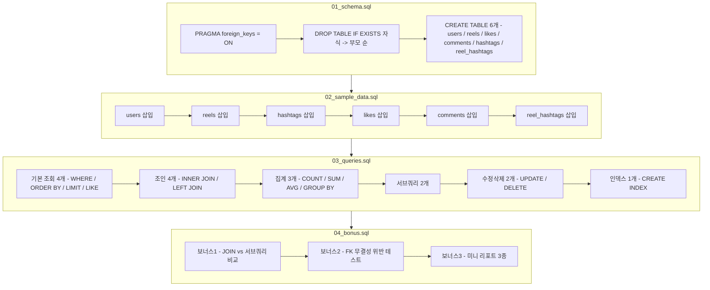

# 프로젝트 소개

인스타그램 릴스와 유사한 SNS 서비스를 가정하여, 데이터베이스 스키마를 설계하고
샘플 데이터를 채운 뒤 실무에서 자주 쓰이는 SQL 패턴(조회, 조인, 집계, 서브쿼리,
수정/삭제, 인덱스)을 구현한 프로젝트입니다. 실행 환경은 SQLite를 기준으로 합니다.

## 파일 구조

```
project-root/
├── 01_schema.sql          # 테이블 생성 (DDL)
├── 02_sample_data.sql     # 샘플 데이터 삽입 (DML)
├── 03_queries.sql         # 핵심 SQL 쿼리 16개
├── 04_bonus.sql           # 보너스 과제 3종
├── SQL_Diagram.png        # ERD 다이어그램
└── README.md              # 프로젝트 설명 문서
```

## 파일 구성

| 파일 | 설명 |
|---|---|
| `01_schema.sql` | 테이블 생성 (DDL). 6개 테이블과 FK 제약조건 정의 |
| `02_sample_data.sql` | 샘플 데이터 삽입 (users 12행, reels 15행, hashtags 10행, likes 25행, comments 16행, reel_hashtags 21행) |
| `03_queries.sql` | 핵심 SQL 쿼리 16개 (기본 조회, 조인, 집계, 서브쿼리, 수정/삭제, 인덱스) |
| `04_bonus.sql` | 보너스 과제 3종 (JOIN vs 서브쿼리 비교, 데이터 정합성 테스트, 미니 리포트) |
| `SQL_Diagram.png` | 전체 테이블 관계를 나타낸 ERD |

## ERD (Entity-Relationship Diagram)
<p align="center">
  
</p>

## 테이블 설계

- **users**: 사용자 정보. `username`, `email`은 `UNIQUE` 제약으로 중복 가입을 방지
- **reels**: 릴스(영상) 정보. `user_id`로 `users`를 참조하는 1:N 관계 (사용자 1명 → 릴스 여러 개)
- **likes**: 좋아요 기록. `user_id`, `reel_id`를 각각 참조하며, `(user_id, reel_id)` 복합 `UNIQUE`로 동일 릴스에 대한 중복 좋아요를 방지
- **comments**: 댓글. `user_id`, `reel_id`를 각각 참조하는 1:N 관계
- **hashtags**: 해시태그 마스터 테이블. `tag_name`은 `UNIQUE`
- **reel_hashtags**: `reels`와 `hashtags`의 N:M 관계를 풀기 위한 연결 테이블. `(reel_id, hashtag_id)` 복합 기본키 사용


## SQL 실행 흐름



FK가 참조하는 부모 테이블이 먼저 채워져야 하므로, 파일 실행 순서(위 다이어그램의
Step1 -> Step4)와 `02_sample_data.sql` 내부의 INSERT 순서(users -> reels -> hashtags
-> likes -> comments -> reel_hashtags)를 모두 지켜야 합니다.

## 실행 순서

```
01_schema.sql -> 02_sample_data.sql -> 03_queries.sql -> 04_bonus.sql
```

모든 스크립트 상단에 `PRAGMA foreign_keys = ON;`을 명시하여, SQLite에서 기본값이
꺼져 있는 외래키 무결성 검사를 켜고 시작합니다.

## 실행 방법

<details>
<summary><h3>방법 1. 터미널에서 sqlite3 CLI 사용</h3></summary>
<div markdown="1">

**sqlite3 설치 확인**

macOS/Linux는 대부분 기본 설치되어 있습니다.
```bash
sqlite3 --version
```
버전이 안 뜨면 macOS는 `brew install sqlite3`, Windows는 [sqlite.org 다운로드 페이지](https://www.sqlite.org/download.html)에서 `sqlite-tools`를 받아 PATH에 등록하면 됩니다.

**DB 파일 생성 후 순서대로 실행**

프로젝트 폴더로 이동한 뒤:
```bash
cd project-root

sqlite3 reels.db < 01_schema.sql
sqlite3 reels.db < 02_sample_data.sql
sqlite3 reels.db < 03_queries.sql
sqlite3 reels.db < 04_bonus.sql
```
이렇게 하면 `reels.db`라는 파일이 생기고, 네 파일이 순서대로 실행됩니다. `03_queries.sql`과
`04_bonus.sql`은 SELECT 결과가 있어도 리다이렉트로 실행하면 결과가 터미널에 그냥 지나가버리니,
결과를 확인하려면 인터랙티브 모드를 쓰는 게 편합니다.

**인터랙티브 모드로 결과 확인하며 실행 (추천)**
```bash
sqlite3 reels.db
```
셸이 열리면:
```sql
.read 01_schema.sql
.read 02_sample_data.sql
.read 03_queries.sql
```
쿼리 하나씩 결과를 보고 싶으면 파일을 열지 않고 직접 붙여넣어도 됩니다. 결과를 표 형태로
보기 좋게 하려면 먼저 아래 설정을 넣어주세요.
```sql
.headers on
.mode column
```

**종료**
```sql
.quit
```

</div>
</details>

<details>
<summary><h3> 방법 2. Docker로 설치 없이 실행</h3></summary>
<div markdown="2">

Docker만 설치되어 있으면 sqlite3를 로컬에 직접 설치하지 않고 컨테이너 안에서 실행할
수 있습니다. 가장 가볍고 안정적인 방법은 alpine 기반 이미지에 sqlite만 얹어서 쓰는
것입니다.

**1) Dockerfile 작성**

프로젝트 폴더에 `Dockerfile.tools` 파일을 만듭니다.
```dockerfile
FROM alpine:3.19
RUN apk add --no-cache sqlite
WORKDIR /data
ENTRYPOINT ["sqlite3"]
```

**2) 이미지 빌드**
```bash
cd project-root
docker build -f Dockerfile.tools -t sqlite-tools .
```

**3) 순서대로 실행 (방법1과 동일한 패턴)**
```bash
docker run --rm -i -v "$(pwd)":/data sqlite-tools reels.db < 01_schema.sql
docker run --rm -i -v "$(pwd)":/data sqlite-tools reels.db < 02_sample_data.sql
docker run --rm -i -v "$(pwd)":/data sqlite-tools reels.db < 03_queries.sql
docker run --rm -i -v "$(pwd)":/data sqlite-tools reels.db < 04_bonus.sql
```
`-v "$(pwd)":/data`로 현재 폴더를 컨테이너의 `/data`에 연결하기 때문에, 컨테이너 안에서
만들어지는 `reels.db`도 호스트(내 컴퓨터)에 그대로 남습니다.

**4) 인터랙티브 모드로 결과 확인하며 실행**
```bash
docker run --rm -it -v "$(pwd)":/data sqlite-tools reels.db
```
```sql
.headers on
.mode column
.read 01_schema.sql
.read 02_sample_data.sql
.read 03_queries.sql
```

**종료**
```sql
.quit
```

**참고**

`nouchka/sqlite3`, `keinos/sqlite3` 같은 이미 만들어진 sqlite3 전용 이미지를 pull
받아 바로 쓰는 방법도 있지만, 제3자가 유지보수하는 이미지라 언제 사라지거나 바뀔지
알 수 없습니다. 위처럼 alpine 기반으로 직접 5줄짜리 Dockerfile을 빌드하는 방식이
용량도 작고(수 MB), 필요할 때 언제든 재현 가능해서 더 안정적입니다.
</div>
</details>

<details>
<summary><h3>방법 3. GUI 툴 사용 (DBeaver, TablePlus 등)</h3></summary>
<div markdown="3">
1. DBeaver나 TablePlus 실행 후 새 연결에서 SQLite 선택
2. DB 파일 경로를 새로 지정하거나(빈 파일 생성) 위에서 만든 `reels.db`를 연결
3. SQL 에디터를 열고 `01_schema.sql` 내용을 붙여넣어 실행(Cmd/Ctrl + Enter)
4. 순서대로 `02_sample_data.sql` -> `03_queries.sql` -> `04_bonus.sql` 반복
5. SELECT 쿼리는 실행 결과가 표 형태로 바로 아래에 표시됨 -> 이 화면을 스크린샷 찍어서
   `execution_results` 폴더에 저장하면 제출용 캡처로 쓸 수 있음

### 주의할 점

- 반드시 순서를 지켜야 합니다: 스키마 -> 샘플 데이터 -> 쿼리 -> 보너스. FK가 부모 테이블을
  참조하기 때문에 순서를 어기면 에러가 납니다.
- `04_bonus.sql`의 보너스 2번(`user_id = 999` INSERT)은 의도적으로 실패하는 쿼리라
  `FOREIGN KEY constraint failed` 에러가 정상입니다. 에러 메시지가 뜨는 게 맞게 실행된 것입니다.
- 재실행하고 싶으면 `reels.db` 파일을 지우고 처음부터 다시 실행하거나, `01_schema.sql`에
  `DROP TABLE IF EXISTS`가 이미 포함돼 있어서 같은 파일에 다시 `.read 01_schema.sql`부터
  돌려도 됩니다.
</div>
</details>

<details>
<summary><h2>요구사항 구현 내역 (03_queries.sql)</h2></summary>
<div markdown="4">

### 1. 기본 조회 (4개)
- Q1: 조회수 10만 이상 릴스 조회 (`WHERE`)
- Q2: 전체 릴스 조회수 내림차순 정렬 (`ORDER BY`)
- Q3: 최신 업로드 릴스 5개 조회 (`ORDER BY` + `LIMIT`)
- Q4: 캡션에 `daily` 포함된 릴스 검색 (`LIKE`)

### 2. 조인 (4개)
- Q5: 릴스 + 업로더 정보 (`INNER JOIN` 1회)
- Q6: 댓글 + 작성자 + 대상 릴스 (`INNER JOIN` 2회)
- Q7: 댓글이 하나도 없는 릴스 (`LEFT JOIN` + `IS NULL`)
- Q8: 릴스 + 해시태그 목록 (`INNER JOIN` 2회)

### 3. 집계 (3개)
- Q9: 사용자별 릴스 수 / 총 조회수 (`COUNT`, `SUM`, `GROUP BY`)
- Q10: 해시태그별 사용 릴스 개수 (`COUNT`, `GROUP BY`)
- Q11: 사용자별 평균 조회수 (`AVG`, `GROUP BY`)

### 4. 서브쿼리 (2개)
- Q12: 전체 평균 조회수보다 높은 릴스 조회
- Q13: 댓글을 한 번도 작성하지 않은 사용자 조회 (`NOT IN`)

### 5. 데이터 수정 및 삭제 (2개)
- Q14: 특정 릴스 조회수 +5000 (`UPDATE`)
- Q15: 특정 좋아요 취소 (`DELETE`)

### 6. 인덱스 (1개)
- Q16: `reels.user_id`에 인덱스 생성. 사용자별 릴스 조회와 users-reels 조인 조건에서
  자주 필터링되는 컬럼이라 조회 성능 향상을 목적으로 함

## 보너스 과제 (04_bonus.sql)

### 보너스 1. JOIN과 서브쿼리 두 방식으로 동일 요구 풀기
"댓글이 하나도 달리지 않은 릴스를 찾는다"는 동일한 요구를 `LEFT JOIN + IS NULL`
방식과 `NOT IN` 서브쿼리 방식 두 가지로 구현하고 결과가 동일함을 확인했습니다.
`NOT IN`은 참조 컬럼에 `NULL`이 존재하면 전체 결과가 빈 값으로 반환되는 함정이
있다는 점, 데이터 규모가 커질수록 `LEFT JOIN`이 인덱스를 활용하기 유리하다는
점을 비교 정리했습니다.

### 보너스 2. 데이터 정합성 깨뜨려 보기
존재하지 않는 `user_id = 999`를 참조하는 릴스를 강제로 `INSERT`하여 FK 제약조건이
정상적으로 삽입을 차단하는지 확인했습니다 (`FOREIGN KEY constraint failed`).
이어서 실제 존재하는 `user_id`로 값을 바꿔 정상적으로 삽입되는 버전도 함께
작성했습니다.

### 보너스 3. 미니 리포트 (핵심 지표 3개)
- 지표 1: 월별 릴스 업로드 건수 추이 (`strftime` 활용, 시간에 따른 업로드량 변화 파악)
- 지표 2: 좋아요 수 기준 인기 릴스 TOP 5 (참여도가 가장 높은 콘텐츠 식별)
- 지표 3: 참여율이 저조한 사용자 목록 (`HAVING`으로 좋아요+댓글 합이 5 미만인 사용자 필터링, 운영 개선 포인트 파악)

## 참고
- 실행 환경: SQLite
- 각 쿼리에는 실행 목적을 주석으로 명시하여, 단순히 문법을 나열하는 것이 아니라
  실제 서비스 운영 관점에서 어떤 질문에 답하기 위한 쿼리인지 알 수 있도록 구성했습니다.
</div>
</details>